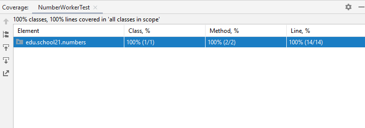

# Day 06 — Java bootcamp
### JUnit/Mockito

### Rules of the Day
- Use the JUnit 5 framework in all tasks.
- Use the following dependencies and plugins to ensure proper operation:
    - maven-surefire-plugin;
    - junit-jupiter-engine;
    - junit-jupiter-params;
    - junit-jupiter-api.
- All tests must be executable by running the command mvn clean compile test.
- The source code of the tested class must be fully covered by all implemented tests. Below is an example of a full coverage demonstration using IntelliJ IDEA for exercise 00:



### Exercise 00 — First Tests

Exercise 00: First Tests ||
---|---
Turn-in directory |	ex00
Files to turn-in |	Tests-folder

Now you need to implement NumberWorker class that contains the following functionality:

```java
public boolean isPrime(int number) {
  ...
}

```
This method determines whether a number is prime and returns true/false for all natural (positive integer) numbers. For negative numbers, as well as 0 and 1, the program will throw an unchecked exception. IllegalNumberException.
```java
public int digitsSum(int number) {
  ...
}
```

This method returns the sum of digits of a source number.

We also need to create the NumberWorkerTest class, which implements the module's testing logic. The methods of the NumberWorkerTest class will check the correct operation of the NumberWorker methods for different input data:
1. isPrimeForPrimes method to check isPrime with prime numbers (at least three);
2. isPrimeForNotPrimes method to check isPrime with composite numbers (at least three);
3. isPrimeForIncorrectNumbers method to check isPrime using incorrect numbers (at least three);
4. a method to check digitsSum using a set of at least 10 numbers.

**Requirements**:
- NumberWorkerTest class must contain at least 4 methods to test NumberWorker functionality.
- Use of @ParameterizedTest and @ValueSource is mandatory for methods 1-3.
- Use of @ParameterizedTest and @CsvFileSource is mandatory for method 4.
- For method 4, you need to prepare a data.csv file where you specify at least 10 numbers and their correct sum of digits. An example of file content:
1234, 10

**Project structure**:

- Tests
    - src
        - main
            - java
                 - edu.school21.numbers
                    - NumberWorker
            - resources
        - test
            - java
                - edu.school21.numbers
                    - NumberWorkerTest
            - resources
                -	data.csv
    - pom.xml

### Exercise 01 — Embedded DataBase

Exercise 01: Embedded DataBase ||
---|---
Turn-in directory |	ex01
Files to turn-in |	Tests

Do not use a heavy DBMS (such as PostgreSQL) to implement integration testing of components that interact with the database. It is best to create a lightweight in-memory database with pre-defined data.  

Implement a DataSource creation mechanism for the HSQL DBMS. To do this, add the spring-jdbc and hsqldb dependencies to the project. Prepare schema.sql and data.sql files describing product table structure and test data (at least five).

Product table structure:
- identifier,
- name,
- price.

Also create an EmbeddedDataSourceTest class. In this class, implement the init() method marked with the @BeforeEach annotation. In this class, implement functionality to create DataSource using EmbeddedDataBaseBuilder (a class in spring-jdbc library). Implement a simple test method to check the return value of getConnection() method created by DataSource (this value must not be null).

**Project structure**:

- Tests
    - src
        - main
            - java
                - edu.school21.numbers
                    - NumberWorker
            - resources
        - test
            - java
                - edu.school21
                    - numbers
                        - NumberWorkerTest
                    - repositories
                        - EmbeddedDataSourceTest
            - resources
                -	data.csv
                -	schema.sql
                -	data.sql
    - pom.xml

### Exercise 02 — Test for JDBC Repository

Exercise 02: Test for JDBC Repository ||
---|---
Turn-in directory |	ex02
Files to turn-in |	Tests

Implement ProductsRepository/ProductsRepositoryJdbcImpl interface/class pair with the following methods:

```java
List<Product> findAll()

Optional<Product> findById(Long id)

void update(Product product)

void save(Product product)

void delete(Long id)
```
You will implement the ProductsRepositoryJdbcImplTest class, which contains methods for testing repository functionality using the in-memory database mentioned in the previous exercise. In this class, you should pre-prepare model objects that will be used for comparison in all tests.

An example of how to declare test data is shown below:
```java
class ProductsRepositoryJdbcImplTest {
  final List<Product> EXPECTED_FIND_ALL_PRODUCTS = ...;
  final Product EXPECTED_FIND_BY_ID_PRODUCT = ...;
  final Product EXPECTED_UPDATED_PRODUCT = ...;
}
```
**Notes**:
1.	Each test must be isolated from the behavior of other tests. Therefore, the database must be in its initial state before each test is run.
2.	Test methods can call other methods that are not under the current test. For example, when testing the update() method, the findById() method can be called to check the validity of the entity update in the database.

**Project structure**:

- Tests
    - src
        - main
            - java
                - edu.school21
                    - numbers
                        - NumberWorker
                    - models
                        - Product
                    - repositories
                        - ProductsRepository
                        - ProductsRepositoryJdbcImpl
            - resources
        - test
            - java
                - edu.school21
                    - numbers
                        - NumberWorkerTest
                    - repositories
                        - EmbeddedDataSourceTest
                        - ProductsRepositoryJdbcImplTest
            - resources
                -	data.csv
                -	schema.sql
                -	data.sql
    - pom.xml

### Exercise 03 — Test for Service

Exercise 03: Test for Service ||
---|---
Turn-in directory |	ex03
Files to turn-in |	Tests

An important rule for module testing is to test a single system component without calling the functionality of its dependencies. This approach allows developers to create and test components independently and to postpone the implementation of certain parts of the application.

Now you need to implement the business logic layer, which is represented by the UsersServiceImpl class. This class contains user authentication logic. It also has a dependency on the UsersRepository interface (in this task, you do not need to implement this interface).

The UsersRepository interface (which you have described) must contain the following methods:
```java
User findByLogin(String login);
void update(User user);
```
It is assumed that the findByLogin method returns a user object found via login, or throws an EntityNotFoundException if no user is found with the specified login. The Update method throws a similar exception when updating a user that does not exist in the database.

The User entity contains the following fields:
- Identifier,
- Login,
- Password,
- Authentication success status (true — authenticated, false — not authenticated).

In turn, the UsersServiceImpl class calls these methods within the authentication function:
```java
boolean authenticate(String login, String password)
```

This method:
1.	Checks if a user has been authenticated to the system using this login. If authentication has been performed, an AlreadyAuthenticatedException must be thrown.
2.	Retrieves the user with this credential from the UsersRepository.
3.	If the retrieved user password matches the specified password, the method sets the authentication success status for the user, updates their information in the database, and returns true. If the passwords do not match, the method returns false.

Your goal is to:
1.	Create a UsersRepository interface.
2.	Create the UsersServiceImpl class and authenticate method.
3.	Create a module test for the UsersServiceImpl class.

Since your goal is to check the correct operation of the authenticate method independently of the UsersRepository component, you should use a mock object and stubs of the findByLogin and update methods (see the Mockito library).

The Authenticate method will be checked for three cases:
1.	Correct login/password (check calling update method with verify statement of Mockito library);
2.	Wrong login;
3.	Wrong password.

**Project structure**:

- Tests
    - src
        - main
            - java
                - edu.school21
                    - exceptions
                        - AlreadyAuthenticatedException
                    - numbers
                        - NumberWorker
                    - models
                        - Product
                        - User
                    - services
                        - UsersServiceImpl
                    - repositories
                        - ProductsRepository
                        - ProductsRepositoryJdbcImpl
                        - UsersRepository
            - resources
        - test
            - java
                - edu.school21
                    - services
                        - UsersServiceImplTest
                    - numbers
                        - NumberWorkerTest
                    - repositories
                        - EmbeddedDataSourceTest
                        - ProductsRepositoryJdbcImplTest
            - resources
                -	data.csv
                -	schema.sql
                -	data.sql
    - pom.xml
